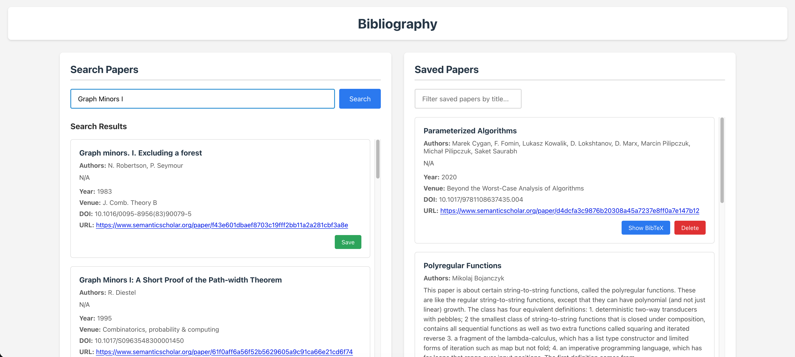

# Bibliography



## How to use 

1. Clone the repository

```bash
git clone git@github.com:katzper-michno/bibliography.git 
```

2. Fill the `.env.example` files with proper values and rename to `.env`

```bash
mv bib-back/.env.example bib-back/.env
mv bib-front/.env.example bib-front/.env
```

```bash
#bib-back/.env
SEMANTIC_SCHOLAR_API_KEY=  #generate your own key or ask someone for theirs:)
PORT=3001 #you can leave default
VAULT_PATH=/path/to/this/repository/vault_example #provide path to your db, you can use the db-example directory in this repository for testing
```

```bash
#bib-front/.env
REACT_APP_BACKEND_BASE_URL=http://localhost:3001/api #you can leave default, should match the PORT variable in bib-back/.env
```

3. Run the app 

```bash
chmod +x run.sh
./run.sh
```

4. Open and have fun! <http://localhost:3000>

## TODO

- [ ] Better BibTeX generation (more fields, more accurate)
- [ ] Possibility to manually edit saved papers
- [ ] Adding PDFs to saved papers
- [ ] SciHub search (?)
