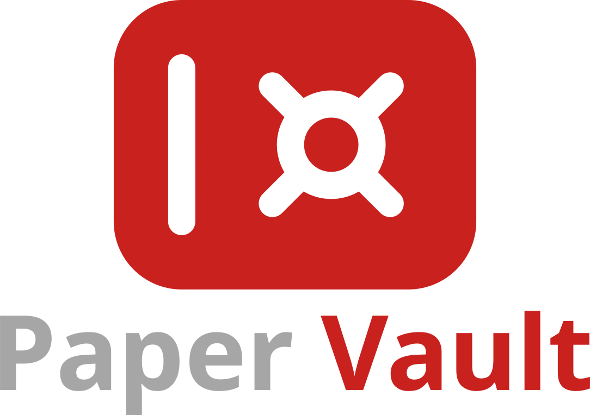

&nbsp;

<p align="center">
  
</p>

<p align="center">
  
  
</p>

<p align="center"><b>A local database of research papers integrated with <a href="https://arxiv.org/">arXiv</a>, <a href="https://openalex.org/">OpenAlex</a> and <a href="https://sci-hub.pl/">Sci-Hub</a></b></p>

&nbsp;

## ⚠️ Limitations

This might change in the future (perhaps not), but currently `paper-vault` **does not work on Windows**. Linux and macOS should be fine.

## 📦 Dependencies

There is not a lot of dependencies. The two I'm aware of are `node` and `jq`. The former you can install according to the [official Node.js installation guide](https://nodejs.org/en/download). The latter is probably packaged for your system of choice.

```bash
# macOS
brew install jq

# Arch Linux
sudo pacman -S jq

# Debian/Ubuntu
sudo apt-get install -y jq
```

## ⚙️ Installation and usage

Currently `paper-vault` is not packaged with any package managers, so you have to use it directly from source.

```
git@github.com:katzper-michno/paper-vault.git
cd paper-vault
chmod +x install.sh
./install.sh            # installation script should work out-of-the-box
pv                      # <-- run it!
```

By default, the binary is placed in `~/.local/bin` so make sure to add it to your `PATH`. You can modify where the binary is placed in `install.sh` script.

To uninstall `paper-vault` from your machine, run the `uninstall.sh` script.

## 🧩 Configuration

The installation script should create a basic configuration file in `~/.config/paper-vault/pv.config.json`. It will look more or less like this:

```json
{
  "BACKEND_PORT": "3001",
  "FRONTEND_PORT": "5173",
  "OPEN_ALEX_API_KEY": "",
  "VAULT_PATH": "/path/to/cloned/repository/vault_example"
}
```

The `OPEN_ALEX_API_KEY` stores your private key to OpenAlex API. **It is not necessary**, but the "web search" functionality of `paper-vault` might be limited without it. Moreover, you can generate the key for free, and **you don't have to send any emails to do it!** - you just have to create an account on [OpenAlex](https://openalex.org/). Check out [official OpenAlex docs](https://developers.openalex.org/guides/authentication#getting-an-api-key) for more information.

Next, the `VAULT_PATH` stores the path to... your vault. By default, it will be set to an example vault in `vault_example`, but you are free to create your own vault anywhere on your machine.

## 💾 How the vault is stored

It is not much - just a `.json` file with directories for attached files. I think the best way to understand it is to look at the example in `vault_example`.

## 🤝 Feedback and contribution

I hope you like `paper-vault`, but if you find any bugs or have suggestions, go straight to [Issues](https://github.com/katzper-michno/paper-vault/issues) and let me know.

## 📋 License

`paper-vault` is licensed under the [MIT License](LICENSE).
