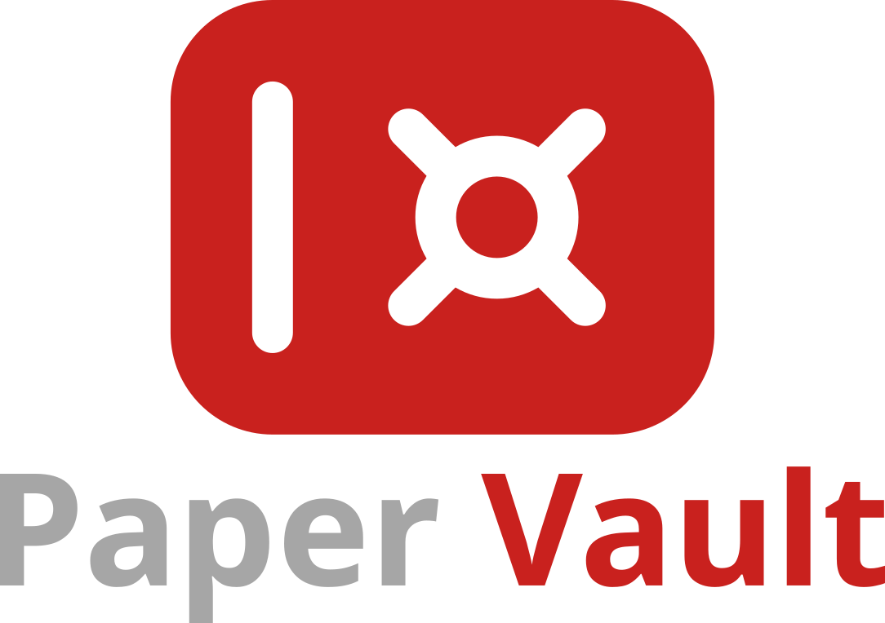

&nbsp;

<p align="center">
  
</p>

<p align="center">
  
  
</p>

<p align="center"><b>A local database of research papers integrated with <a href="https://arxiv.org/">arXiv</a>, <a href="https://openalex.org/">OpenAlex</a>, <a href="https://www.semanticscholar.org/">Semantic Scholar</a> and <a href="https://sci-hub.pl/">Sci-Hub</a></b></p>

&nbsp;

## ⚠️ Limitations

This might change in the future (perhaps not), but currently `paper-vault` **does not work on Windows**. Linux and macOS should be fine.

## 📦 Dependencies

There is not a lot of dependencies. The two I'm aware of are `node` and `jq`. The former you can install according to the [official Node.js installation guide](https://nodejs.org/en/download). The latter is probably packaged for your system of choice.

```bash
# macOS
brew install jq

# Arch Linux
sudo pacman -S jq

# Debian/Ubuntu
sudo apt-get install -y jq
```

## ⚙️ Installation and usage

Currently `paper-vault` is not packaged with any package managers, so you have to use it directly from source.

```
git@github.com:katzper-michno/paper-vault.git
cd paper-vault
chmod +x install.sh
./install.sh            # installation script should work out-of-the-box
pv                      # <-- run it!
```

By default, the binary is placed in `~/.local/bin` so make sure to add it to your `PATH`. You can modify where the binary is placed in `install.sh` script.

To uninstall `paper-vault` from your machine, run the `uninstall.sh` script.

## 🧩 Configuration

The installation script should create a basic configuration file in `~/.config/paper-vault/pv.config.json`. It will look more or less like this:

```json
{
  "BACKEND_PORT": "3001",
  "FRONTEND_PORT": "5173",
  "OPEN_ALEX_API_KEY": "",
  "SEMANTIC_SCHOLAR_API_KEY": "",
  "VAULT_PATH": "/path/to/cloned/repository/vault_example",
  "READONLY_SECRET": "",
  "READONLY_ALLOW_NOTES": "false",
  "READONLY_ALLOW_FILES": "false"
}
```

The `OPEN_ALEX_API_KEY` stores your private key to OpenAlex API. **It is not necessary**, but the "web search" functionality of `paper-vault` might be limited without it. Moreover, you can generate the key for free, and **you don't have to send any emails to do it!** - you just have to create an account on [OpenAlex](https://openalex.org/). Check out [official OpenAlex docs](https://developers.openalex.org/guides/authentication#getting-an-api-key) for more information.

Similarly with `SEMANTIC_SCHOLAR_API_KEY`, although, it this case, the key is rather required, otherwise the "web search" functionality will just not use Semantic Scholar as a backend. Also, the key application is a bit more of a hustle, you actually have to fill a form on [Semantic Scholar API-KEY form](https://www.semanticscholar.org/product/api#api-key-form) to receive it.

Next, the `VAULT_PATH` stores the path to... your vault. By default, it will be set to an example vault in `vault_example`, but you are free to create your own vault anywhere on your machine.

## 🔒 Read-only mode

If you want to host your vault publicly (e.g. on your research page) so others can browse and search it without being able to change anything, set `READONLY_SECRET` to a private string of your choosing. Once set, anyone visiting the frontend without the right access code only gets read/search access - all write actions (adding, editing, deleting, attaching files) and the web search panel are hidden and, more importantly, rejected by the backend even if someone tries to call the API directly.

Visitors are shown a banner where they can enter the access code. On success, a cookie is stored in their browser so they don't have to re-enter it on every visit, and they get the same full access you have locally.

By default, personal notes and attached files are hidden from read-only visitors. You can opt into showing them with `READONLY_ALLOW_NOTES` and `READONLY_ALLOW_FILES` (set either to `"true"`) - with the latter enabled, read-only visitors can view/download attached files in their own browser.

Leaving `READONLY_SECRET` empty (the default) disables read-only mode entirely - everyone gets full access, exactly as before this feature existed.

## 💾 How the vault is stored

It is not much - just a `.json` file with directories for attached files. I think the best way to understand it is to look at the example in `vault_example`.

## 🤝 Feedback and contribution

I hope you like `paper-vault`, but if you find any bugs or have suggestions, go straight to [Issues](https://github.com/katzper-michno/paper-vault/issues) and let me know.

## 📋 License

`paper-vault` is licensed under the [MIT License](LICENSE).
